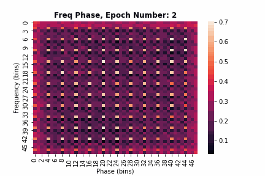
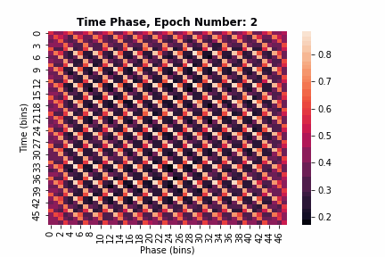
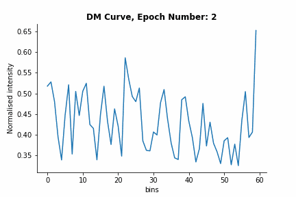
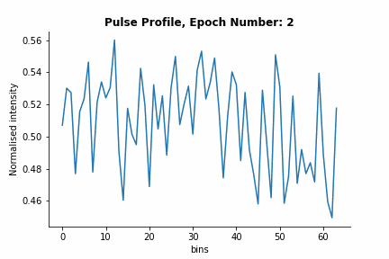
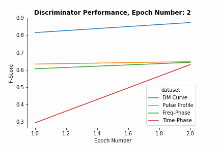
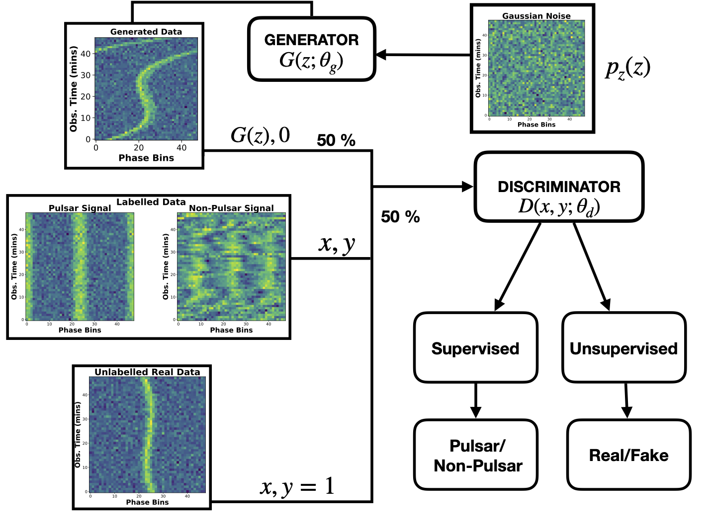

# **Pulsar Candidate Identification Using Semi-Supervised Generative Adversarial Networks (SGAN).**

<H2 align="center"> <b> Generator (100 labelled + 10,000 unlabelled samples) </H2>

  
   
 

 
 

  
   
 

  
   
 

**How to score your Pulsar Candidates (PFD and/or AR files) ?**

1. Run the code **extract_features_for_classification.py**. This reads PRESTO pfd or DSPSR's ar pulsar candidates and extracts the 4 features used by the AI to classify candidates. The output of this code is a bunch of numpy array files. In order to run this code, you will need to download the following docker image https://hub.docker.com/r/sap4pulsars/pics_ai. 

2. Run the code **compute_sgan_score.py**. This code requires an anaconda3 installation along with Keras with Tensorflow2.X backend. For quick setup, download the following docker image https://hub.docker.com/repository/docker/vishnubk/sgan. 

If you would like to avoid docker, **compute_sgan_score.py** can be easily run by creating your own conda environment with python 3.6, keras tensorflow and any other packages you would need. https://docs.conda.io/projects/conda/en/latest/user-guide/tasks/manage-environments.html

**How to Re-train SGAN with your own data?**

**Update: 3 March 2022: Previous version of the retraining code mixed up the training & validation data and its associated file labels. Download the new version if you plan to retrain this network (Does not impact the original results reported in the paper)**

  A. Run the code **retrain_sgan.py**
  
  B. Run **check_retrained_model_performance.py** to test the performance of your retrained SGAN Model against a test-set
  
  
**Instructions on how to download the training and test set used in the paper.**

1. If you want access to raw data i.e the PFD files to extract your own features. You can find them in this FTP link.

Raw Data (272 GB): ftp.mpifr-bonn.mpg.de:outgoing/vishnu/sgan_data/sgan_lowlat_raw_dataset.tar.gz

File Labels Full Dataset: ftp.mpifr-bonn.mpg.de:outgoing/vishnu/sgan_data/labelled_candidates_sgan_paper_jan_2021.csv

Test Set Labels: ftp.mpifr-bonn.mpg.de:outgoing/vishnu/sgan_data/test_set_relabelled_jan_2021.csv

2. If you would like to use the same 4 features (Freq-Phase, Time-Phase, DM-Curve and Pulse-Profile) used in the paper. Then you can directly pull the normalised & downsampled data. This can be directly fed into your favorite neural network. 

Downsampled & Normalised Files (3 GB): ftp.mpifr-bonn.mpg.de:outgoing/vishnu/sgan_data/downsampled_normalised_data.tar.gz
  
  
